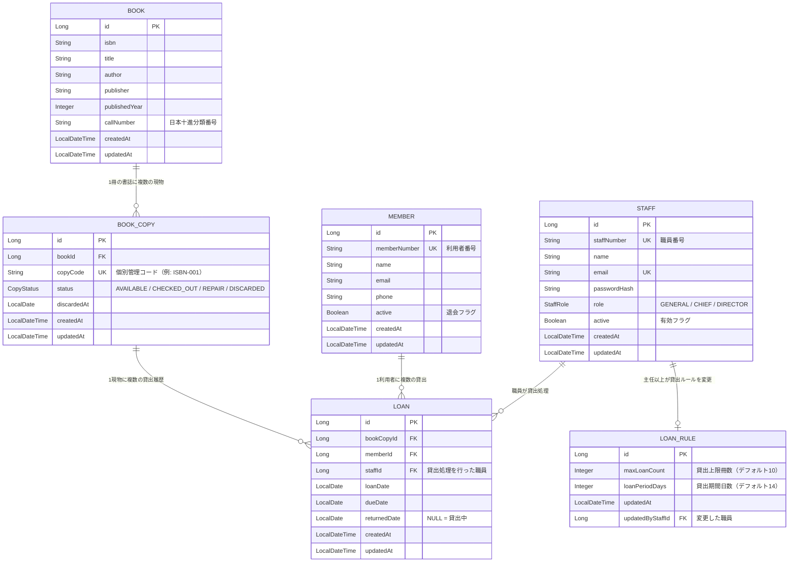
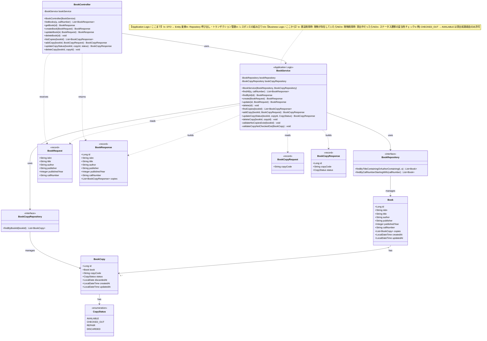

# アーキテクチャ設計書 — みどり市立図書館管理システム

> Must have（US-003, 005, 006, 007, 013, 014, 015）のみを対象とする

---

## ER図（Mermaid）



---

## クラス図 — Book / BookService / BookController



---

## 責務分担まとめ

| クラス | 責務 | 責務の境界 |
|-------|------|-----------|
| `BookController` | HTTPリクエストの受付・レスポンス返却 | **URLマッピング・HTTPステータス管理のみ**。ビジネス判断は一切しない |
| `BookService` | アプリケーションロジック + ビジネスロジック | 下表参照 |
| `Book` / `BookCopy` | データ構造の定義（JPA Entity） | 状態を持つだけ。振る舞いはServiceに委ねる |
| `BookRequest/Response` | データ転送オブジェクト（record） | Entityを外部に直接露出しない |

### BookService の内部境界

```
┌─────────────────────────────────────────────────┐
│                  BookService                    │
│                                                 │
│  【Application Logic】                          │
│  ・DTO → Entity 変換                            │
│  ・Repository の呼び出し                        │
│  ・@Transactional によるトランザクション管理     │
│  ・Entity → ResponseDTO への組み立て            │
│                                                 │
│  ─ ─ ─ ─ ─ ─ ─ ─ ─ ─ ─ ─ ─ ─ ─ ─ ─ ─ ─ ─   │
│                                                 │
│  【Business Logic】                             │
│  ・書誌削除時: 現物が1冊以上あれば削除禁止      │
│  ・現物削除時: 貸出中（CHECKED_OUT）なら禁止    │
│  ・ステータス遷移ルールの検証                   │
│    CHECKED_OUT → AVAILABLE は                  │
│    貸出処理（LoanService）経由のみ許可          │
└─────────────────────────────────────────────────┘
```

> **なぜ Business Logic を Service に置くか**
> Entityはデータ構造の定義に留め、ドメインルールはServiceに集約することで、
> テスト（Mockito）でRepositoryをモック化しながらビジネスルールだけを検証できる。

---

## エンティティ設計の補足

### BOOK と BOOK_COPY の分離について

- `BOOK`：ISBN・タイトル・著者など「書誌情報」を表す。同じ本が複数冊あっても1レコード。
- `BOOK_COPY`：物理的な1冊を表す。ステータス（在庫／貸出中／修繕中／廃棄）は冊ごとに管理。
- これにより US-006「同一ISBNで複数冊を管理できる」を満たす。

### LOAN の返却判定について

- `returnedDate` が `NULL` → 貸出中
- `returnedDate` に日付あり → 返却済み
- 返却処理時に `BOOK_COPY.status` を `AVAILABLE` に更新する。

### LOAN_RULE について

- システム全体で1レコードのみ保持するシングルトン設定テーブル。
- 変更操作は `STAFF.role = CHIEF or DIRECTOR` のみ許可（US-015, US-007）。

---

## REST APIエンドポイント一覧（図書CRUD）

> 対象: `BOOK`（書誌情報）および `BOOK_COPY`（現物管理）

### 書誌情報 `/api/books`

| メソッド | パス | 責務 | 権限 |
|---------|------|------|------|
| `GET` | `/api/books` | 書誌一覧取得。`q`（タイトル・著者部分一致）、`callNumber`（分類番号）でフィルタ可 | 全職員 |
| `GET` | `/api/books/{id}` | 書誌1件取得。紐づく現物（`BookCopy`）一覧も含めて返す | 全職員 |
| `POST` | `/api/books` | 書誌新規登録（タイトル・著者・ISBN・出版社・出版年・分類番号） | 全職員 |
| `PUT` | `/api/books/{id}` | 書誌情報の全項目更新 | 全職員 |
| `DELETE` | `/api/books/{id}` | 書誌論理削除。紐づく現物が1冊以上ある場合は `400 Bad Request` | CHIEF以上 |

### 現物管理 `/api/books/{bookId}/copies`

| メソッド | パス | 責務 | 権限 |
|---------|------|------|------|
| `GET` | `/api/books/{bookId}/copies` | 指定書誌の現物一覧取得（ステータス・管理コード含む） | 全職員 |
| `POST` | `/api/books/{bookId}/copies` | 現物1冊を新規登録（管理コード・初期ステータス=AVAILABLE） | 全職員 |
| `PATCH` | `/api/books/{bookId}/copies/{copyId}/status` | 現物のステータス変更（AVAILABLE / REPAIR / DISCARDED） | 全職員 |
| `DELETE` | `/api/books/{bookId}/copies/{copyId}` | 現物の論理削除（廃棄処理）。貸出中の場合は `409 Conflict` | CHIEF以上 |

### レスポンス設計の補足

- `GET /api/books/{id}` のレスポンスイメージ:
  ```json
  {
    "id": 1,
    "isbn": "978-4-xxx-xxxxx-x",
    "title": "吾輩は猫である",
    "author": "夏目漱石",
    "publisher": "○○出版",
    "publishedYear": 1905,
    "callNumber": "913.6",
    "copies": [
      { "id": 1, "copyCode": "978-4-xxx-001", "status": "AVAILABLE" },
      { "id": 2, "copyCode": "978-4-xxx-002", "status": "CHECKED_OUT" }
    ]
  }
  ```

- エラーレスポンスは統一形式:
  ```json
  { "status": 400, "message": "現物が登録されているため書誌を削除できません" }
  ```

---

### TDDにおける責務分離の活かし方

**Application Logic（機械的な処理）**
- DTO ↔ Entity 変換
- Repository 呼び出し・`@Transactional` 管理
- レスポンス組み立て

**Business Logic（ドメインのルール）**
- 書誌削除 → 現物ありなら禁止
- 現物削除 → 貸出中なら禁止
- ステータス遷移の妥当性（`CHECKED_OUT → AVAILABLE` は `LoanService` 経由のみ）

**この分離がTDDで活きる理由:**
- Business Logic は Repository をモックすれば単体で検証できる
- `BookServiceTest` で `when(bookCopyRepository.findByBookId(...)).thenReturn(...)` を使って「現物あり→削除禁止」だけをテストできる

---

### STAFF.role について

- `GENERAL`（一般職員）：貸出・返却・蔵書参照のみ
- `CHIEF`（主任）：利用者個人情報の閲覧・貸出ルール変更を追加許可
- `DIRECTOR`（館長）：全機能 + 職員アカウント管理
